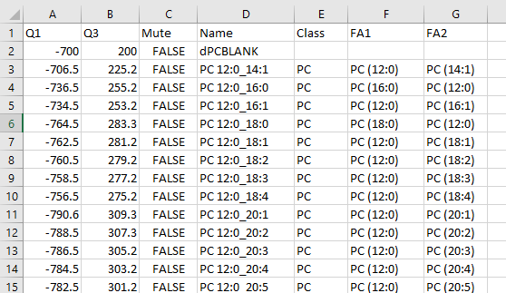
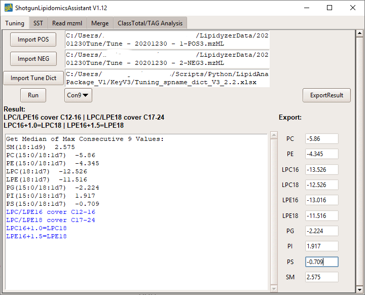
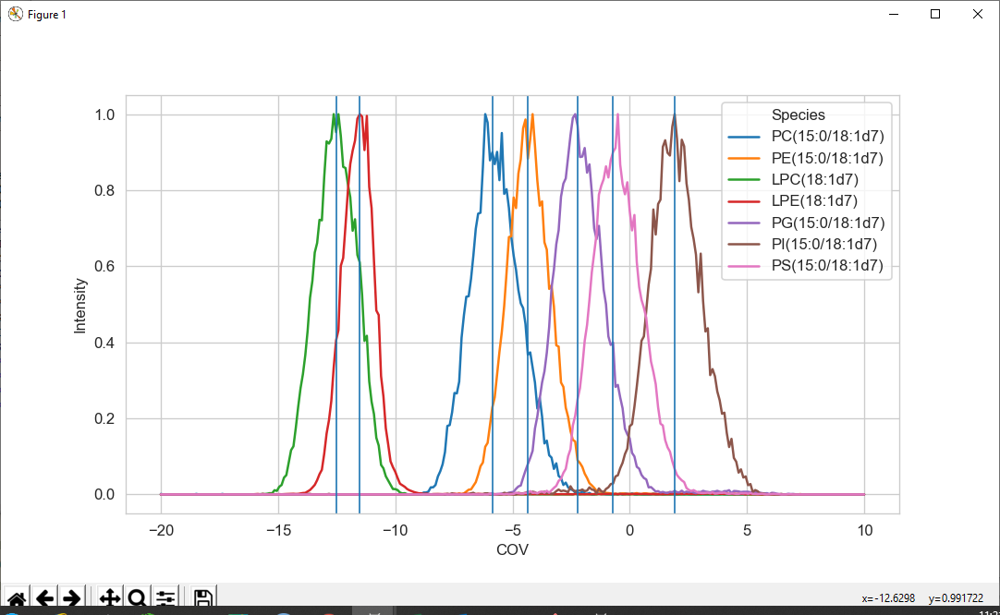
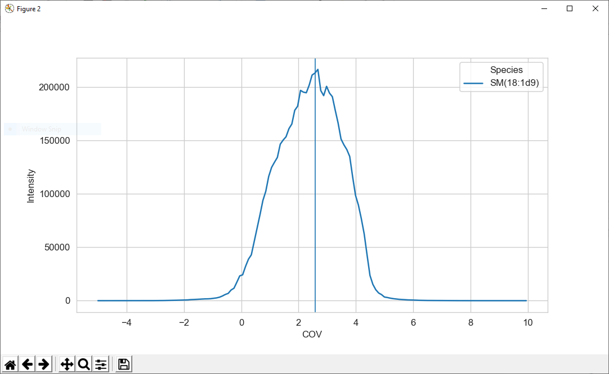
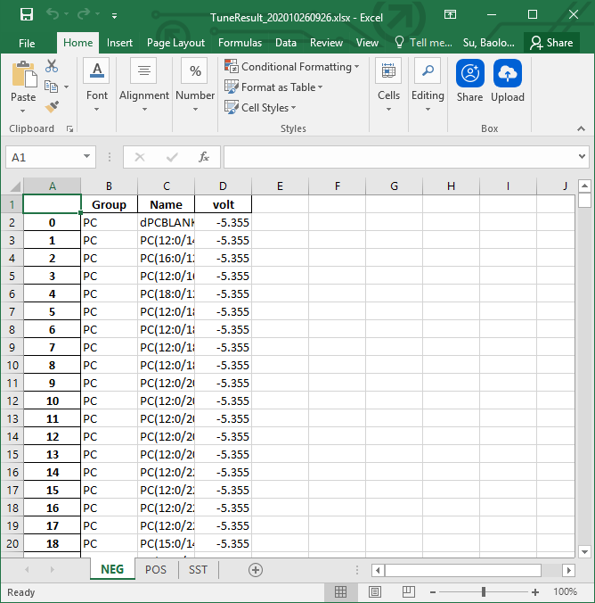
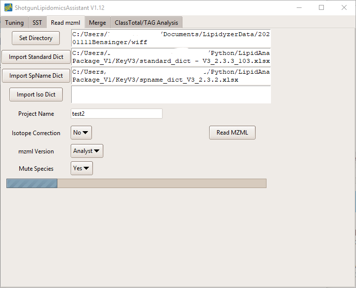
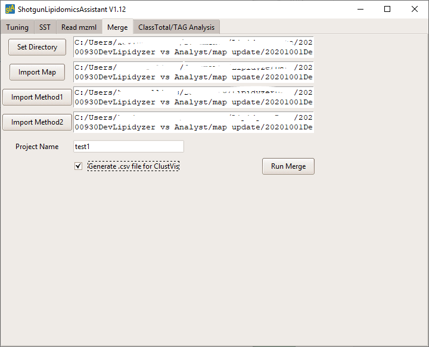
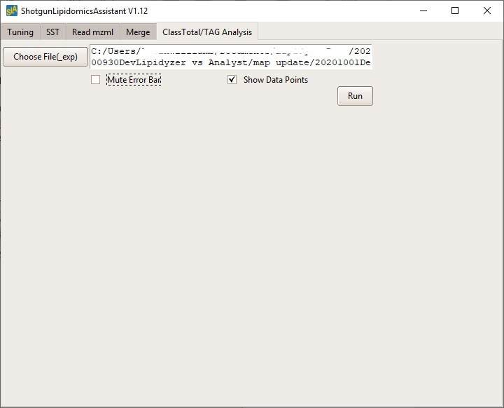

<!-- PROJECT SHIELDS -->
[![MIT License][license-shield]][license-url]

<!-- PROJECT TITLE -->

 <h3 align="center">Shotgun Lipidomics Assistant</h3>
  

    A python project to read and analysis Sciex Analyst output data
     
    <a href="https://www.uclalipidomics.net/"><strong>UCLA Lipidomics Core</strong></a>
     
    <a href="https://youtu.be/1bBZkzZ6BM0">View Demo</a>
  

<!-- TABLE OF CONTENTS -->
## Table of Contents

* [Getting Started](#getting-started)
* [Dictionary Files](#dictionary-files)
* [Tuning](#Tuning)
  * [Instrument Setup](#Instrument-Setup)
  * [Run](#Run)
  * [Tuning Analysis](#Tuning-Analysis)
* [Suitability Test](#Suitability-Test)
  * [Setup](#Setup)
  * [SST Run](#SST-Run)
  * [SST Analysis](#SST-Analysis)
* [Sample Run](#Sample-Run)
  * [Run Setup](#Run-Setup)
  * [Run](#run-1)
* [Data Analysis](#Data-Analysis)
  * [Setup](#Setup-1)
  * [Read MZML](#Read-MZML)
  * [Merge data with sample map](#Merge-data-with-sample-map)
  * [Further Analysis](#Further-Analysis)

<!-- Dictionary Files -->
## Dictionary Files
### Species List (Spname_dict)
This spread sheet contains the information of species we scan for. The order and info should be the same as the method MRM list in Analyst. 
The Class column is used for class total analysis. The FA1/FA2 columns are used for fatty accid analysis.

<!-- Getting Started -->
## Getting Started
1. Download the latest release of [SLA_V1.2](releases) from Github and extract the zip file. If desired, create
Exe shortcut to desktop, then run SLA_V1.12.exe.
2. If it does not open properly, or if it collapses while running, try to open it from
command prompt to check the error message.
3. To convert wiff file to mzml file, you need to download and isntall MSconvertGUI from
[Proteowizard](http://proteowizard.sourceforge.net/download.html). (Note: We have been using version 3.0.19082-ade61137d. Some updated
versions may not transfer the data or file name correctly.)
4. A spreadsheet program must be installed on the control computer (Excel or LibreOffice).
5. Download Analyst method files and Excel files. [KeyV1_2.0](KeyV1_2.0) for LWM version or [KeyV3](KeyV3) for our extended version.

<!-- Tuning – Instrument Setup -->
## Tuning

### Instrument Setup
1. This protocol assumes that users are utilizing a Sciex Lipidyzer with the 100ul sample
loop installed in the Shimadzu Autosampler.
2. Prior to Tuning/Sample Run, make sure that the instrument is topped off with
appropriate solvents and solutions. The pump system should be supplied with running
buffer (50/50% Methanol/Dichloromethane with 10mM ammonium acetate). The
autosampler wash should be topped off with 2-propanol. The SelexION should be
supplied with 1-propanol as modifier.
3. Tuning solution is prepared by diluting EquiSPLASH™ LIPIDOMIX® (Avanti, 330731-1EA) 1
to 20 with running buffer. The syringe pump should be loaded with .5-1mL of this
tuning solution and connected to the electrode (the autosampler output is disconnected
from the mass spec for this step).
4. Load a sample vial containing running buffer in Position 1 in sample rack. This will be
utilized in the Tuning and Suitability steps.

### Run
1. It is recommended that you create a new project or subproject for each experiment in
order to avoid confusion in appropriately tuned methods. In Analyst: Tools → Project →
Create Project
2. Copy “Neg Infusion COV 3500_SPLASH”, “Pos Infusion COV 3500_SPLASH”, “SST v3”,
“Method 1 v3” and “Method 2 v3” from provided method package to the current
project “Acquisition Method” folder.
3. “Hardware Config” → Activate “Lipidyzer” profile
4. Acquire → Ready Instrument
5. Purge Modifier and wait 30min for instrument to warm up
6. While waiting, set up batches. Negative and positive infusion batches should each
contain three repeats of the same respective method.
7. For Positive Batch: Build Acquisition Batch → add batch name(e.g. “Tune – *Date* – 1”)
and add 3 samples named “POS1/2/3” (all drawing from vial position 1) → submit
8. For Negative Batch: Build Acquisition Batch → add batch name(e.g. “Tune – *Date* – 2”)
and add 3 samples named “NEG1/2/3” (all drawing from vial position 1) → submit
9. Start syringe pump 3-5min before sample run start

### Tuning Analysis:
1. Following the run, find and copy both sets of .WIFF files to a working folder in a location
of your choice. Convert to mzml with MSConvertGUI.
2. To read Tuning data with SLA, select the **Tuning** tab.
3. Click Import POS/Import NEG and choose the corresponding mzml files. (We
recommend using the last one among the 3 replicates.)
4. Click Import Tune Dict to import the Tuning_spname_dict_xxx.xlsx file.
5. Choose peak finding method from drop down list. We recommend “Con9”.
6. Hit the “Run” button, the auto selected peak results will be printed to the Result
window and plots will pop out. (The Group column in the POS and NEG tab in
Tuning_spname_dict_xxx.xlsx file are corresponding to the items listed under the Export
area. You can customize it by editing the Group column.)
7. Fill in COV values in the Export area. You can copy and paste the recommended values
from results to Export boxes. Alternatively, you can manually choose COV values. You
can use your mouse to point at a different peaks in the plots. The x shown on the
bottom right corner of the plot is the COV value. Note that most tuning mixes have a
single LPC and LPE species and yet these subclasses have two different COV values for
shorter and longer chain species. The calculation for the offset between these is
provided on the tab. Copy the one COV value and calculate the other COV from the
first. Hit ExportResult button when finished. Result will be saved to a xlsx file under the
same directory with Mzml files. (The excel file will be open automatically. A command
prompt may pop-up. You can close it after the excel file is open.)

8. Copy/paste the volt column to the corresponding Analyst method COV column. The
“POS” and “NEG” tabs correspond to the respective experiments in “Method 1”. The
SST tab contains COV values for both positive and negative experiments in the SST
method. Save the respective files after this modification.

<!-- Suitability Test -->
## Suitability Test

### Setup
(Note: The Suitability Test is not required but is recommended to ensure that the instrument is
in good working order and that the previous tuning step was carried out properly. The
Suitability Test mix should be prepared fresh on a regular basis. Baseline results for the
suitability test should be established and significant decreases should be troubleshot
appropriately.)

1. The suitability test mix is prepared from two working stocks: the Lipidyzer System
Suitability Kit (Sciex 5040407) and the PG/PI/PS mix from Avanti (described below).
2. The PG/PI/PS mix is prepared from 17:0-18:1 PI-d5, 17:0-18:1 PG-d5 and 17:0-18:1 PS-
d5 (Avanti 850111L-500ug, 858133L-1mg, 858151L-1mg). A 100ug/mL stock of these
three compounds should be prepared by diluting in 50/50 DCM/Methanol. Several mLs
can be prepared at once and aliquoted into vials or ampules. As an example, the
following formulation makes 1mL (100uL PG, 200uL PI, 100uL PS, 300uL Methanol,
300uL DCM).
3. The Suitability Test mix is prepared by combining 10ul of Lipidyzer System Suitability
Mix with 10ul of PG/PI/PS mix in 980ul of running buffer.
4. Prepare Suitability Test mix in a robovial and place in the 105 position in the sample
rack. Make sure there is sufficient volume of running buffer in the position 1 vial.
5. Reconnect the autosampler output to the source.

### SST Run
1. If instrument was set to standby, a modifier purge and 30 minute warm up will be
required before starting. If instrument remained ready after tune, you may proceed
immediately to the suitability test.
2. Build batch using the “SST v3” method under the batch name “SST – *Date* - 1”. Create
2 samples in the batch: a “buffer” in vial 1 and a “LOD” in vial 105.
3. Submit and Run batch.

### SST Analysis
1. Find and copy .WIFF files to a working folder. Extract to Mzml format with
MSConverterGUI.
2. To read the Suitability Test results with the SLA, select the **SST** tab.
3. Import the Mzml file with the SST result (the “LOD” file above).
4. Import the Tuning_spname_dict_xxx.xlsx file
5. Hit Run and the result will be saved to an xlsx file under the same directory with the
Mzml file
6. Compare results with previous suitability tests.

<!-- Sample Run -->
## Sample Run
### Run Setup
(Note: This protocol does not describe the sample extraction. There are a number of protocols
that detail extraction. The addition of standards prior to extraction is key to good quantitative
measurements. Check the “Standard Info” tab on Standard Dictionary Excel. This document
details the recommended standard formulation. This formulation can be optimized to the
samples you are analyzing. The 5 products that make up the v3 standard are Lipidyzer Standard
Kit (Sciex 5040156), PG Internal Standard Mixture - UltimateSPLASH™ (Avanti 330827), PI
Internal Standard Mixture - UltimateSPLASH™ (Avanti 330830), PS Internal Standard Mixture -
UltimateSPLASH™ (Avanti 330828), and 15:0-18:1-d7-PA (Avanti 791642).)
1. Lipid extracts are dried down, resuspended in 275ul and transferred to a robovial.
Samples should be assigned numbers that are utilized in the batch setup. These
numbers should be filled into the Sample Map along with sample information.
2. These samples should be placed in the autosampler sample rack in appropriate order.
3. Prior to starting the run, make sure all solvents and running buffer are topped off.

### Run
1. If the instrument has been on standby before starting the sample run, a modifier purge
and 30 minute warm up will be needed.
2. If you are performing a large experiment (60+ samples), it may be worthwhile to run
Method 1 and Method 2 batches separately. This allows you to check over the samples
and correct any plumbing problems before doing a second injection of precious
samples.
3. Each batch should be created with the sample numbers assigned above and the correct
vial positions. Note that all samples to be analyzed must be assigned with unique names. 
We recomend using 01 through 99 as sample names(01,02... instead of 1,2...), and names containing letters or symbols as
controls(i.e. “buffer”, “QC”, “QCSpike”, etc.). These names are then pasted to the first column in the map file and assigned
sample information.(in the map file you can use 1,2... instead of 01,02...) Try to avoid using special characters here.

4. Submit and run these two batches. After completing both Method batches, proceed with data analysis.

<!-- Data Analysis -->
## Data Analysis
### Setup
1. You will need a Species Name Dictionary (spname_dict_xxx.xlsx) and a Standard Dictionary
(standard_dict_xxx.xlsx) to perform the data analysis step. Make sure these match the
Analyst methods utilized in your sample run.
2. There is a Mute column in spname_dict_xxx. You can mute a species from the output by
setting the value to TRUE. (Internal Standards and species end with “_2” are always
muted from output.)

Q1    | Q3   | Mute | Name
------|------|------|-------
-700  | 200  |FALSE |dPCBLANK
-706.5| 225.2|FALSE |PC(12:0/14:1)
-736.5| 255.2|FALSE |PC(16:0/12:0)
-734.5| 253.2|FALSE |PC(12:0/16:1)

3. To update internal standard information, open the “standard_dict_xxx.xlsx” file. Make
sure that the appropriate standards are listed, that the actual concentrations match the Lot of
standards you are using, and that the volumes used reflect what the amounts you
actually spiked into each sample. If you are using a different amount/type of sample than 0.025ml plasma, please asjust the SampleNorm factor in the map file so the SLA will get the correct normalization in the next step. Do not change the Coef column in the Standard_dict.
(note: We are using 0.025ml of plasma sample and 1/4 the amount of the LWM recommended internal standard. This way we will get the same results from LWM and SLA.)
4. You will also need the Sample Map(sample submission form) you
filled out while setting up the samples. Follow the example on the Sample Map. Name the actuall map sheet as "Sheet1". Make
sure that each sample is appropriately demarcated into experiments and groups, and
that the normalization values for each sample are correct. GroupNum will be used to sort x ticks in plots. You can
change it to rearrange them. To exclude samples, such as bad samples/subgroups or blank/QC_spike, you can assign them to a seperate experiment, or simply exclude them from the map. For different type of samples, the sample normalization values are:
   - Plasma: volumn in ml
   - Tissue: 
   - Cell: number of cell in 10 million

### Read MZML
1. Find and copy .WIFF files to an appropriate working folder. Convert to mzml format
with MSconvertGUI. (Note: the program will read all mzml files in the folder. Please only
keep the relevant mzml files there.)
2. Select the **Read mzml** tab on the SLA.
3. Set Directory to the folder of mzml files.
4. Import Standard_dict and spname_dict files.
5. Import isotope correction list if you want to do isotope correction.
6. Select the version of raw data file. (wiff file generated from LWM run or Analyst run)
7. If you want to mute species which you labeled as TRUE in the spname_dict file, chose
Yes for Mute Species.
8. Put in your project name. You can also leave it blank.
9. Hit Read MZML. Results will be saved under the same folder with the mzml files.

### Merge data with sample map
1. Select **Merge** tab on SLA.
2. Set directory to where you want to keep the outputs.
3. Import sample map.
4. Select output excel files m1&amp;m2 from **Read mzml** session. (if your experiment has only 1
method, then load it to m1 and leave m2 blank.)

5. Put in your project name or leave it blank.
6. Select if you want to export a csv file which can be uploaded to [ClustVis](https://biit.cs.ut.ee/clustvis/) for analysis.
7. Hit Run Merge. Results will be saved in the directory you selected.

### Further Analysis
1. Prior to performing the ClassTotal/TAG Analysis, you may want to move the primary
data file to a new subfolder (especially if there are multiple data files from multiple
demarcated experiments in the batch).
2. Select ClassTotal/TAG Analysis tab.
3. Load the _Exp_ file from the Merge session

4. Select if you want to add error bar and data points to the TAG analysis bar plots.
5. Hit Run TAG. Results will be saved under the same folder with your *_Exp_* file.

[license-shield]: https://img.shields.io/github/license/othneildrew/Best-README-Template.svg?style=flat-square
[license-url]: LICENSE
